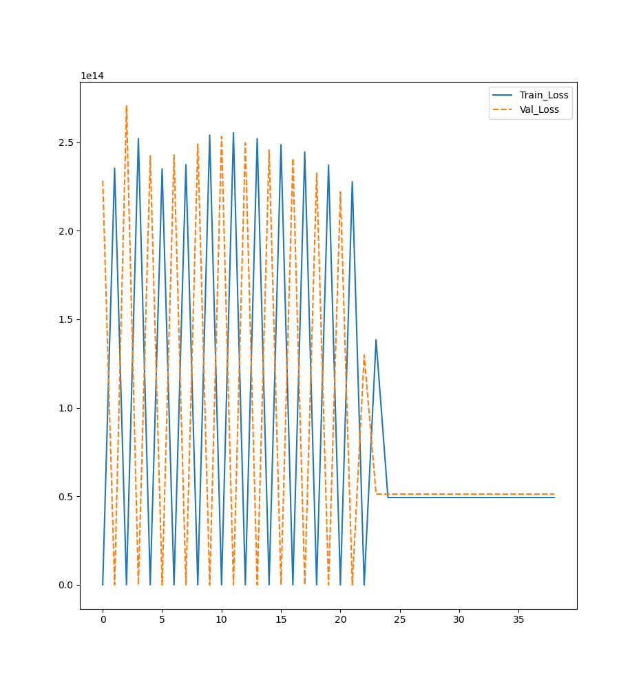
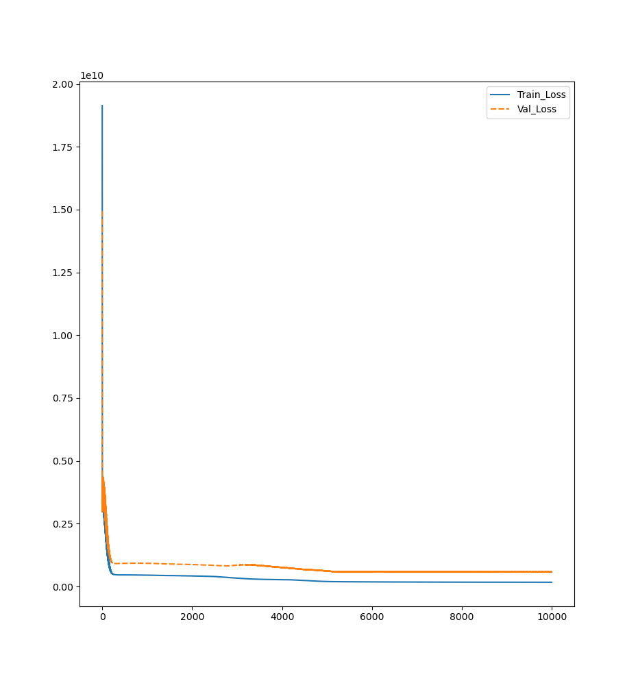

# Multi Layer Perceptron using just Numpy

This is an implementation of MLP or Multi Layer Perceptron, more commonly known as a Dense Neural Network using just Numpy.

~~I currently have no idea how I am going to do this. Let's see!~~ Done!

View the [mathematical derivation for this code](./assets/dev.md)

~~First prototype is ready! Though I have to clean the code.~~
All done! Just a bit of cleaning work left.

~~The backprop algorithm (according to my very basic testing), after training for 1500 epochs with a learning rate of 0.01 results in 93.7% success rate over 1000 attempts, and 93.0% success rate with 500 epochs in training.~~

That was because I was accidentaly using the output from second last layer to determine cost 😅.

There may be many inefficiencies in the system right now as it is the limit of my knowledge right now and I am therefore looking for suggestions on how to improve it.

As this was done without any external help or even googling how to do this and that, I am quite proud of this code.

The current implementation managed to achieve the error score of 0.22 (average 0.26) on the [House Price Prediction Dataset](https://www.kaggle.com/competitions/house-prices-advanced-regression-techniques) achieving rank of approx 4060 out of 4900. Definitely on the lower side, but it is to be kept in mind that neither did I perform any optimisations nor is this dataset optimal for DL owing to its very small size.

---
# Working

- getdata.py performs basic preprocessing of data and returns train, validation and test sets.
- As before, the main contents of the project are in backend.py file.
- First are the utility functions.
  - relu() as evident by name runs Rectified Linear Unit on the input.
$$y = \begin{cases}
		x & \text{if } x \geq 0 \\
		0 & \text{if } x < 0\\
		\end{cases}$$
  - drelu() returns the derivative of relu().
  - clip() is meant for gradient clipping to prevent exploding gradients.
  - mse() returns mean square error.
$$mse(\hat{y} - y) = \frac{(\hat{y} - y)^2}{2m}$$
- Then comes the **Dense** class, which is my implementation of a fully connected layer.
  - **init** - Initialises weights matrix, shape (input_features *x* output_features) and bias matrix, shape (1 *x* output_features). It uses normal distribution of mean 0 and standard deviation 1 to initialise them.
  - **forward** - Standard forward pass.
$$y = X \cdot W + b$$
  - **backward** - This is the interesting part. It is my implementation of the backward pass in which I use chain rule to calculate the gradients.
    - **Inputs** - 
      - **da_i** - $\frac{dJ}{da_i}$ is required to compute the gradients.
      - **a_i_1** - Input upon which current layer operated.
    - **Outputs** -
      - **dw_i** - Gradients of weights with respect to cost function.$$\frac{dJ}{dW_i} = \frac{dJ}{da_i} \circ \frac{da_i}{dW_i}$$
      - **db_i** - Gradients of biases w.r.t. cost function.$$\frac{dJ}{db_i} = \frac{dJ}{da_i} \circ \frac{da_i}{db_i}$$
      - **da_i_1** - Gradients of inputs w.r.t. cost function. It will passed on to the previous layer as da_i.$$\frac{dJ}{da_{i-1}} = \frac{dJ}{da_i} \circ \frac{da_i}{da_{i-1}}$$
- The next class, i.e., Model stores these Dense layers in a list and provide additional functionality over them. It takes an array storing number of neurons for each layer as an input.
  - It first initialises an array of Dense layers using the input given.
  - During the forward pass, input is passed sequentially passed through each layer and activation function (relu) is applied, except on the output layer.
  - During the backward pass, $\frac{dJ}{da_L}$ is calculated first and passed onto the layer's backward function which sequentially makes its way through all the layers, last to first, gradually updating their parameters.

This is the basic gist of the project. It is to be noted that pyTorch style of model definition is also possible using this method.

There is a problem in this implementation right now, which is

I do not know what is causing this back-and-forth in the loss and any suggestions will be appreciated.

And this was the final train-val loss curve for the model that I trained on this dataset.
