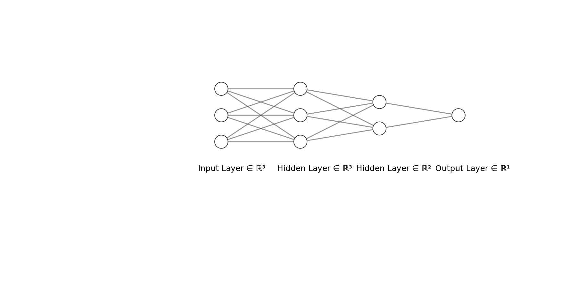

## Development Diaries

I am using this file to basically log the process I use to solve this problem as it has been 2 days and I have not been able to solve it yet.

### 18/04/2024

The forward pass has been completed and was really simple, nothing major to note except for some shape shifting shenanigans.

The part that is still left is backward pass. Here is what I have been able to do till now - 

- Let us have a neural network with 3 layers (excluding the input layer), $L_1$, $L_2$, $L_3$.

- For input data, X, let - 
  - $n_s$ = number of examples
  - $n_f$ = number of features
- For $L_i$, let - 
  - $n_i$ = number of neurons in the layer
  - $W_i$ = weights of the layer, shape = ($n_{i - 1}$, $n_i$)
  - $b_i$ = biases of the layer, shape = ($n_s$, $n_i$)
  - $a_i$ = output of the layer (after applying activation function, relu for this project), shape = ($n_s$, $n_i$)

- The forward pass is simple enough. For the backward pass, after a lot of thinking, I have though of a method although it is not working yet.
  - For example, to calculate $\frac{dJ}{dW_3}$, what we can do is first calculate $\frac{dJ}{da_3}$, then calculate $\frac{da_3}{dW_3}$. After that we can use chain rule.
  $$\frac{dJ}{dW_3} = \frac{dJ}{da_3} \cdot \frac{da_3}{dW_3}$$
  $$\frac{dJ}{dW_3} = \frac{d}{da_3}(\frac{(a_3 - y)^2}{2m}) \cdot \frac{d}{dW_3}(\sigma(a_2 \cdot W_3 + b_3))$$ 
  $$\frac{dJ}{dW_3} = \frac{(a_3 - y)}{m} \cdot \sigma(a_2 \cdot W_3 + b_3) \cdot a_2$$
  - This is where the problem appears. Consider the shape of each matrix.
    $$(n_2, n_3) = (n_s, n_3) \cdot (n_s, n_3) \cdot (n_s, n_2)$$
  - No amount of dot products and transposes will result in the shapes of LHS and RHS being equal. There are two ways this could be solved - 
    1. By collapsing $\frac{dJ}{da_3}$ - We could collapse the entire $\frac{dJ}{da_3}$ matrix by taking its mean, thereby making its shape $(1, 1)$.
    2. Element wise multiplication - We could also perform element-wise multiplication on $\frac{dJ}{da_3}$ and $\sigma(a_2 \cdot W_3 + b_3)$.
  - While both of these method would result in the desired shape being produced, the seconf method appears to be more suitable, atleast for now.
  - Using the second method -
$$\frac{dJ}{da_3} = \frac{d}{da_3}(\frac{(a_3 - y)^2}{2m}) = \frac{a_3 - y}{m}$$
$$\frac{da_3}{dW_3} = \frac{d}{dW_3}(\sigma(a_2 \cdot W_3 + b_3)) = \sigma'(a_2 \cdot W_3 + b_3) \cdot a_2$$
$$\frac{da_3}{db_3} = \frac{d}{db_3}(\sigma(a_2 \cdot W_3 + b_3)) = \sigma'(a_2 \cdot W_3 + b_3)$$
$$\frac{da_3}{da_2} = \frac{d}{da_2}(\sigma(a_2 \cdot W_3 + b_3)) = \sigma'(a_2 \cdot W_3 + b_3) \cdot W_3$$
$$\frac{dJ}{dW_3} = \frac{dJ}{da_3} \circ \frac{da_3}{dW_3}$$
$$\frac{dJ}{db_3} = \frac{dJ}{da_3} \circ \frac{da_3}{db_3}$$
$$\frac{dJ}{da_2} = \frac{dJ}{da_3} \circ \frac{da_3}{da_2}$$
Finally,
$$\frac{dJ}{dW_3} = a_2^T \cdot (\frac{a_3 - y}{m} \circ \sigma'(a_2 \cdot W_3 + b_3))$$
$$\frac{dJ}{db_3} = \frac{a_3 - y}{m} \circ \sigma'(a_2 \cdot W_3 + b_3)$$
$$\frac{dJ}{da_2} = (\frac{a_3 - y}{m} \circ \sigma'(a_2 \cdot W_3 + b_3)) \cdot W_3^T$$
Generalising it,
$$\frac{dJ}{da_{i}} = (\frac{dJ}{da_{i+1}} \circ \sigma(a_i \cdot W_{i+1} + b_{i+1}) \cdot W_{i+1}^T$$
$$\frac{dJ}{dW_i} = a_{i-1}^T \cdot (\frac{dJ}{da_i} \circ \sigma'(a_{i-1} \cdot W_i + b_i))$$
$$\frac{dJ}{db_i} = \frac{dJ}{da_i} \circ \sigma'(a_{i-1} \cdot W_i + b_i)$$